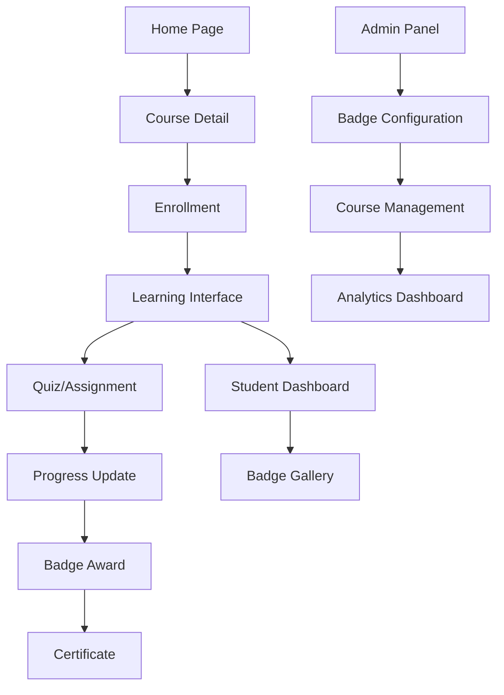
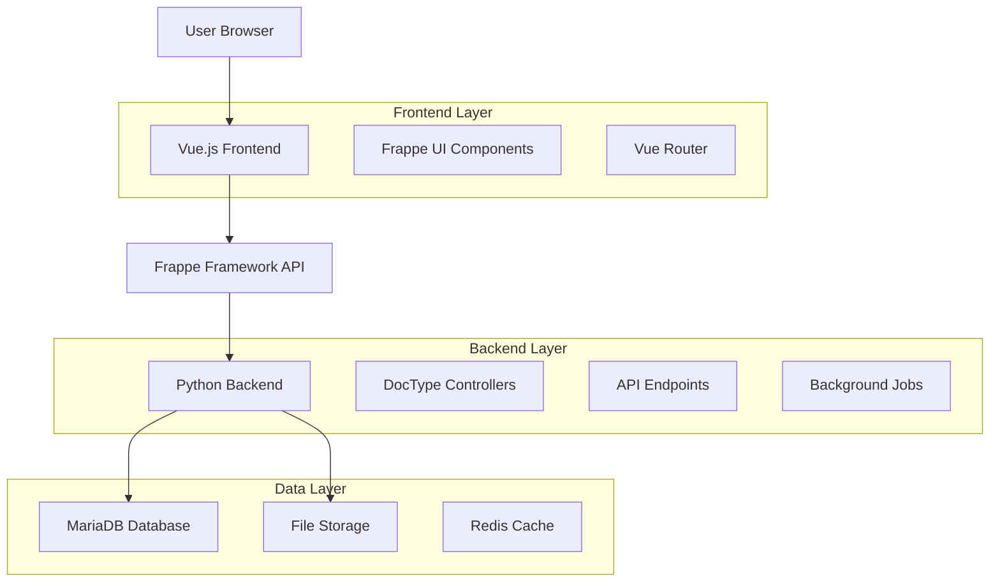
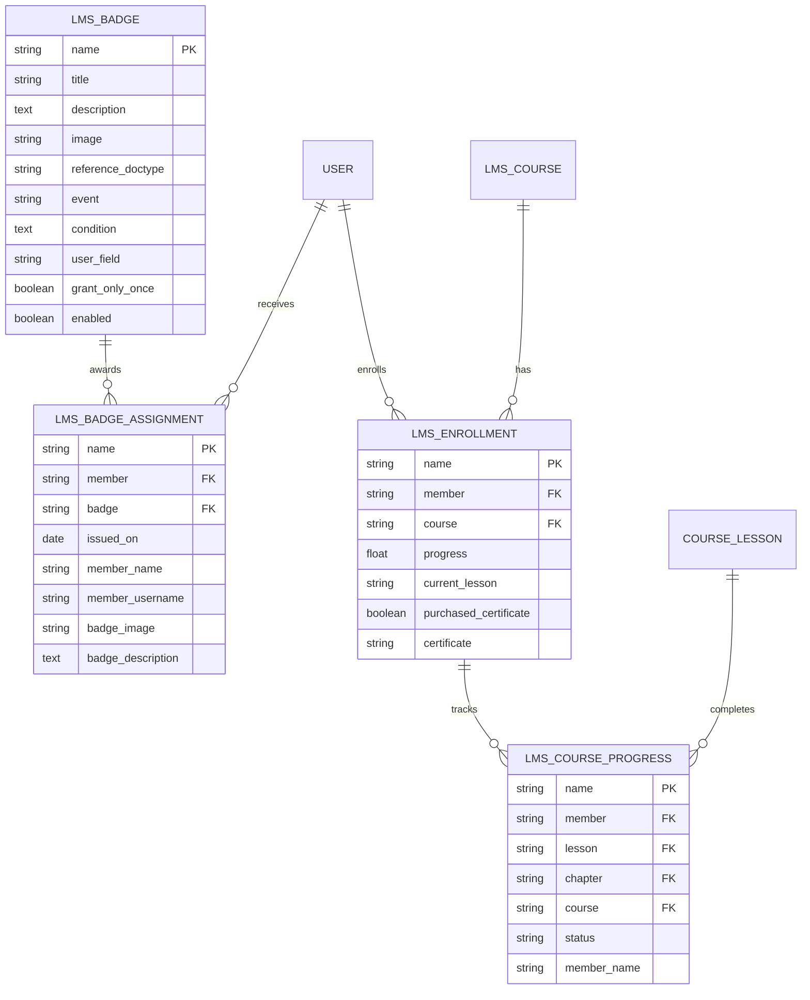

# Frappe LMS - Comprehensive Documentation

## 1. Product Overview

Frappe Learning is an easy-to-use, open-source Learning Management System built on the Frappe Framework. It provides a structured platform for creating and managing online courses with integrated gamification features to enhance learner engagement.

- **Primary Purpose**: Enable educators and organizations to create, manage, and deliver structured online learning experiences with built-in progress tracking and achievement systems.
- **Target Users**: Educational institutions, corporate training departments, individual course creators, and learners seeking structured online education.
- **Market Value**: Offers a modern, user-friendly alternative to complex LMS platforms like Moodle, with integrated gamification and social learning features.

## 2. Core Features

### 2.1 User Roles

| Role | Registration Method | Core Permissions |
|------|---------------------|------------------|
| LMS Student | Email registration | Can enroll in courses, track progress, earn badges, submit assignments |
| Course Creator | Role assignment by admin | Can create and manage courses, view student progress |
| Moderator | Admin assignment | Full course management, user management, badge administration |
| Batch Evaluator | Admin assignment | Can evaluate assignments and quizzes for specific batches |
| System Manager | Admin assignment | Complete system administration and configuration |

### 2.2 Feature Modules

Our LMS consists of the following main functional areas:

1. **Course Management**: Course creation, chapter organization, lesson management
2. **Learning Experience**: Video lessons, quizzes, assignments, progress tracking
3. **Gamification System**: Badge awards, progress visualization, achievement tracking
4. **Batch Management**: Group learning, live classes, cohort management
5. **Assessment Tools**: Quiz creation, assignment submission, automated evaluation
6. **Certification**: Course completion certificates, badge display
7. **Analytics Dashboard**: Progress reports, completion statistics, performance metrics

### 2.3 Page Details

| Page Name | Module Name | Feature Description |
|-----------|-------------|---------------------|
| **Home Page** | Course Discovery | Browse available courses, search functionality, featured content display |
| **Course Detail** | Course Information | Course overview, instructor details, curriculum preview, enrollment options |
| **Learning Interface** | Lesson Player | Video playback, content display, progress tracking, note-taking, discussions |
| **Student Dashboard** | Progress Overview | Enrolled courses, completion status, earned badges, upcoming assignments |
| **Quiz Interface** | Assessment Tool | Question display, answer submission, immediate feedback, score tracking |
| **Assignment Portal** | Submission System | Assignment details, file upload, submission history, grade display |
| **Badge Gallery** | Gamification Display | Earned badges showcase, badge descriptions, achievement timeline |
| **Batch Dashboard** | Group Learning | Live class schedule, batch members, group discussions, announcements |
| **Admin Panel** | System Management | User management, course approval, badge configuration, analytics reports |
| **Certificate View** | Achievement Display | Generated certificates, download options, verification details |

## 3. Core Process

### Student Learning Flow
1. **Registration & Enrollment**: User registers → browses courses → enrolls in desired courses
2. **Learning Journey**: Access lessons → complete content → take quizzes → submit assignments
3. **Progress Tracking**: System tracks completion → updates progress percentage → awards badges
4. **Achievement**: Complete course requirements → receive certificate → display achievements

### Instructor Flow
1. **Course Creation**: Create course structure → add chapters and lessons → configure assessments
2. **Content Management**: Upload videos → create quizzes → design assignments → set badge criteria
3. **Student Monitoring**: Review progress reports → evaluate submissions → provide feedback
4. **Batch Management**: Create learning cohorts → schedule live sessions → manage discussions

### Gamification Flow
1. **Badge Configuration**: Admin creates badges → sets trigger conditions → defines award criteria
2. **Automatic Awards**: System monitors user actions → evaluates conditions → awards badges automatically
3. **Progress Visualization**: Track lesson completion → calculate course progress → display achievements



## 4. Gamification System Deep Dive

### 4.1 Badge System Architecture

The LMS implements a comprehensive badge system with the following components:

**Badge Configuration (LMS Badge)**
- **Title & Description**: Human-readable badge information
- **Image**: Visual representation of the achievement
- **Reference DocType**: What entity triggers the badge (Course, Quiz Submission, etc.)
- **Event Type**: When to award (New record, Value Change, Auto Assign)
- **Conditions**: Python/JSON conditions for automatic awarding
- **Grant Settings**: One-time or repeatable awards

**Badge Assignment (LMS Badge Assignment)**
- **Member**: User who earned the badge
- **Badge**: Reference to the badge definition
- **Issued Date**: When the badge was awarded
- **Metadata**: Member details and badge information for display

### 4.2 Progress Tracking System

**Course Progress Calculation**
```python
def get_course_progress(course, member):
    lesson_count = get_lessons(course, get_details=False)
    completed_lessons = frappe.db.count(
        "LMS Course Progress",
        {"course": course, "member": member, "status": "Complete"}
    )
    return (completed_lessons / lesson_count) * 100
```

**Progress Tracking Components**
- **Lesson Progress**: Individual lesson completion status
- **Course Progress**: Overall course completion percentage
- **Program Progress**: Multi-course program advancement
- **Visual Indicators**: Progress bars, completion badges, percentage displays

### 4.3 Achievement Triggers

Badges can be awarded based on:
- **Course Enrollment**: Welcome badges for new students
- **Lesson Completion**: Progress milestone achievements
- **Quiz Performance**: High score or perfect score badges
- **Assignment Submission**: Participation and quality awards
- **Course Completion**: Graduation and mastery badges
- **Custom Conditions**: Complex criteria using Python expressions

## 5. User Interface Design

### 5.1 Design Style
- **Primary Colors**: Blue (#4463F0) for primary actions, gray tones for neutral elements
- **Button Style**: Rounded corners with subtle shadows, consistent sizing
- **Typography**: Clean, readable fonts with clear hierarchy (headings, body text, captions)
- **Layout Style**: Card-based design with responsive grid layouts, top navigation
- **Icons**: Feather icons for consistency, custom LMS icons for specific features
- **Gamification Elements**: Badge displays with hover effects, progress bars with animations

### 5.2 Page Design Overview

| Page Name | Module Name | UI Elements |
|-----------|-------------|-------------|
| **Home Page** | Course Grid | Card-based course display, search bar, filter options, hero section |
| **Learning Interface** | Video Player | Full-width video player, sidebar navigation, progress indicator, note panel |
| **Student Dashboard** | Progress Overview | Progress cards, badge showcase, course grid, statistics widgets |
| **Badge Gallery** | Achievement Display | Badge grid layout, modal popups for details, timeline view |
| **Quiz Interface** | Assessment UI | Question cards, answer options, progress bar, timer display |
| **Admin Panel** | Management Interface | Data tables, form modals, chart widgets, configuration panels |

### 5.3 Responsiveness
The application is mobile-first responsive with:
- **Desktop**: Full feature set with sidebar navigation
- **Tablet**: Adapted layouts with collapsible sidebars
- **Mobile**: Touch-optimized interface with bottom navigation
- **Progressive Enhancement**: Core functionality works on all devices

## 6. Technical Architecture

### 6.1 Architecture Design



### 6.2 Technology Stack
- **Frontend**: Vue.js 3 + Frappe UI + Vite + TailwindCSS
- **Backend**: Frappe Framework (Python) + MariaDB
- **Additional**: Redis for caching, background job processing

### 6.3 Route Definitions

| Route | Purpose |
|-------|----------|
| `/lms` | Main LMS homepage with course listings |
| `/courses/{course-name}` | Individual course detail and enrollment |
| `/courses/{course-name}/learn/{lesson-id}` | Lesson learning interface |
| `/dashboard` | Student dashboard with progress and badges |
| `/badges` | Badge gallery and achievement showcase |
| `/batches/{batch-id}` | Batch-specific dashboard and activities |
| `/quiz/{quiz-id}` | Quiz taking interface |
| `/assignment/{assignment-id}` | Assignment submission portal |
| `/certificate/{certificate-id}` | Certificate display and download |
| `/admin/lms` | Administrative interface for LMS management |

## 7. Database Schema - Gamification Focus

### 7.1 Data Model Definition



### 7.2 Data Definition Language

**Badge System Tables**

```sql
-- LMS Badge Table
CREATE TABLE `tabLMS Badge` (
    `name` VARCHAR(140) PRIMARY KEY,
    `title` VARCHAR(140) NOT NULL,
    `description` TEXT,
    `image` TEXT,
    `reference_doctype` VARCHAR(140),
    `event` VARCHAR(20) DEFAULT 'New',
    `condition` TEXT,
    `user_field` VARCHAR(140),
    `grant_only_once` TINYINT(1) DEFAULT 0,
    `enabled` TINYINT(1) DEFAULT 1,
    `creation` DATETIME(6),
    `modified` DATETIME(6)
);

-- Badge Assignment Table
CREATE TABLE `tabLMS Badge Assignment` (
    `name` VARCHAR(140) PRIMARY KEY,
    `member` VARCHAR(140) NOT NULL,
    `badge` VARCHAR(140) NOT NULL,
    `issued_on` DATE NOT NULL,
    `member_name` VARCHAR(140),
    `member_username` VARCHAR(140),
    `badge_image` TEXT,
    `badge_description` TEXT,
    `creation` DATETIME(6),
    `modified` DATETIME(6),
    FOREIGN KEY (`member`) REFERENCES `tabUser`(`name`),
    FOREIGN KEY (`badge`) REFERENCES `tabLMS Badge`(`name`)
);

-- Course Progress Table
CREATE TABLE `tabLMS Course Progress` (
    `name` VARCHAR(140) PRIMARY KEY,
    `member` VARCHAR(140),
    `lesson` VARCHAR(140),
    `chapter` VARCHAR(140),
    `course` VARCHAR(140),
    `status` VARCHAR(20) DEFAULT 'Incomplete',
    `member_name` VARCHAR(140),
    `creation` DATETIME(6),
    `modified` DATETIME(6),
    INDEX `idx_course_member` (`course`, `member`),
    INDEX `idx_lesson_member` (`lesson`, `member`)
);

-- Sample Badge Data
INSERT INTO `tabLMS Badge` VALUES
('course-completion', 'Course Completion', 'Awarded for completing a full course', '/files/completion-badge.png', 'LMS Enrollment', 'Value Change', 'doc.progress == 100', 'member', 1, 1, NOW(), NOW()),
('first-lesson', 'First Steps', 'Awarded for completing your first lesson', '/files/first-lesson-badge.png', 'LMS Course Progress', 'New', 'doc.status == "Complete"', 'member', 1, 1, NOW(), NOW()),
('quiz-master', 'Quiz Master', 'Awarded for scoring 100% on a quiz', '/files/quiz-master-badge.png', 'LMS Quiz Submission', 'New', 'doc.score == 100', 'member', 0, 1, NOW(), NOW());
```

## 8. API Endpoints

### 8.1 Gamification APIs

**Badge Management**
```python
# Award badge manually
POST /api/method/lms.lms.doctype.lms_badge.lms_badge.assign_badge
# Get user badges
GET /api/resource/LMS Badge Assignment?filters=[["member","=","user@example.com"]]
```

**Progress Tracking**
```python
# Update lesson progress
POST /api/method/lms.lms.doctype.course_lesson.course_lesson.save_progress
# Get course progress
GET /api/method/lms.lms.utils.get_course_progress
```

**Analytics**
```python
# Course progress distribution
GET /api/method/lms.lms.api.get_course_progress_distribution
# Progress summary report
GET /api/resource/LMS Enrollment?fields=["member","progress","course"]
```

## 9. Key Gamification Features Summary

### 9.1 Implemented Features
✅ **Badge System**: Comprehensive badge creation, automatic awarding, and display
✅ **Progress Tracking**: Lesson, course, and program-level progress calculation
✅ **Achievement Display**: Badge galleries and progress visualization
✅ **Conditional Awards**: Complex rule-based badge awarding system
✅ **Progress Analytics**: Detailed reporting and progress distribution charts

### 9.2 Gamification Elements
- **Achievement Badges**: Visual rewards for milestones and accomplishments
- **Progress Bars**: Visual feedback on learning advancement
- **Completion Tracking**: Detailed monitoring of learning activities
- **Milestone Recognition**: Automatic acknowledgment of learning achievements
- **Visual Feedback**: Immediate progress updates and achievement notifications

### 9.3 Missing Gamification Features
❌ **Leaderboards**: No competitive ranking system implemented
❌ **Points System**: No numerical scoring beyond quiz scores
❌ **Social Features**: Limited peer comparison or social achievements
❌ **Streaks**: No consecutive learning day tracking
❌ **Challenges**: No time-based or competitive challenges

This comprehensive documentation covers the Frappe LMS architecture, features, and gamification system. The platform provides a solid foundation for online learning with built-in achievement tracking and badge systems to enhance learner engagement.