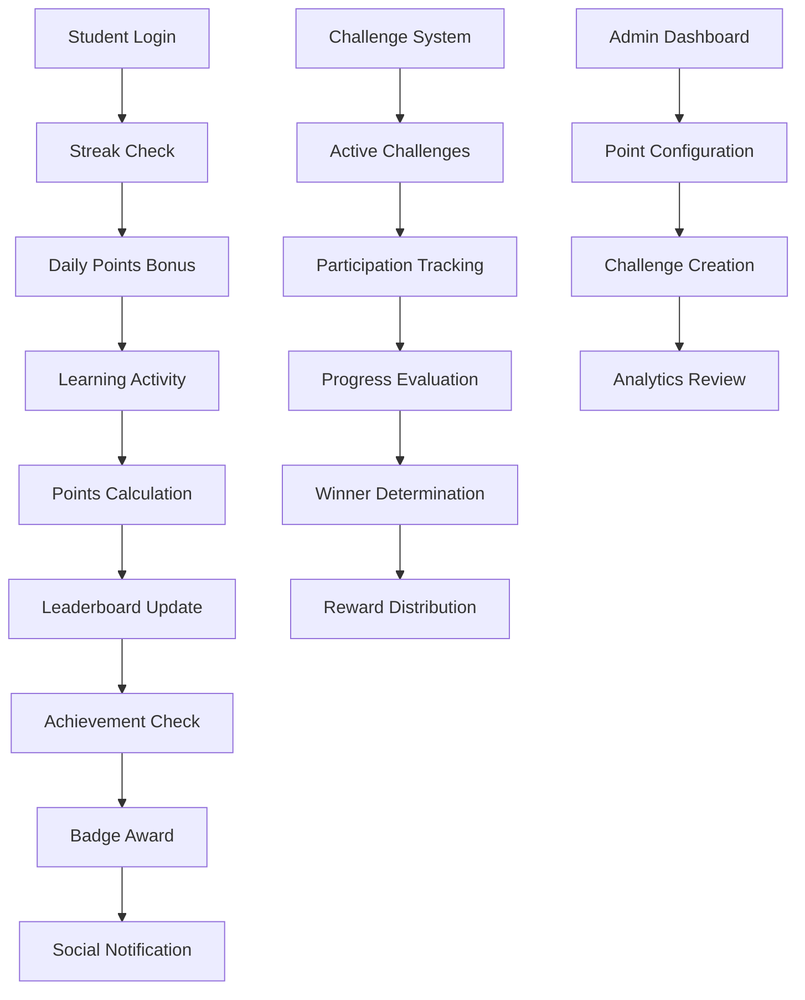
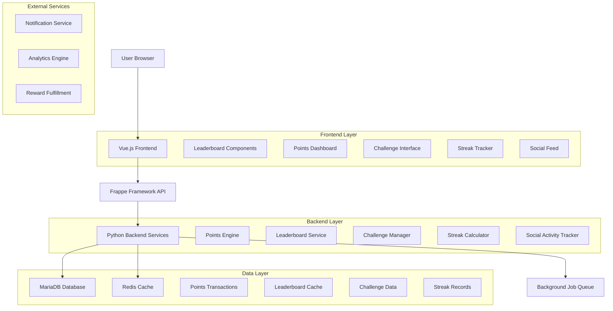
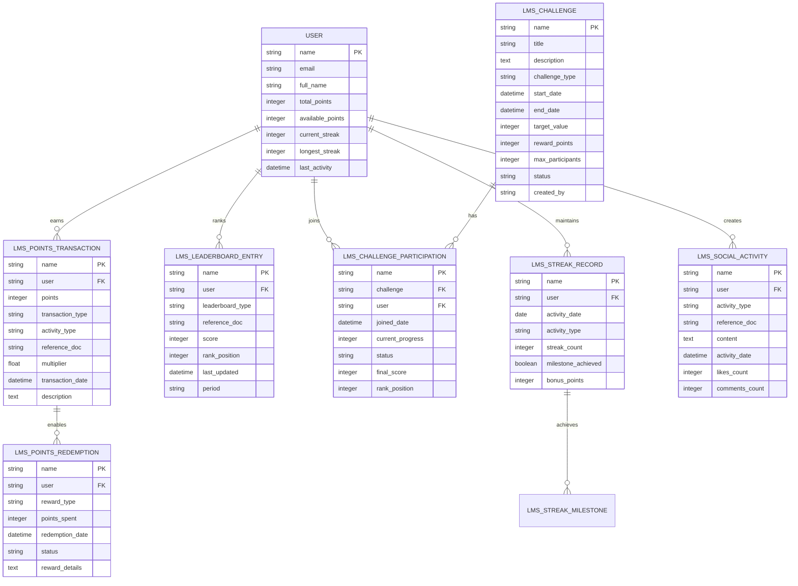

# Frappe LMS - Gamification Enhancement Requirements

## 1. Product Overview

This document outlines the requirements and technical specifications for implementing missing gamification features in Frappe LMS to enhance user engagement and learning motivation through competitive elements, social interaction, and achievement tracking.

- **Primary Purpose**: Enhance learner engagement through competitive gamification elements including leaderboards, points system, social features, streaks, and challenges.
- **Target Users**: Students seeking competitive learning experiences, instructors wanting to motivate learners, and administrators managing engagement metrics.
- **Market Value**: Transform Frappe LMS into a comprehensive gamified learning platform that rivals modern educational platforms like Duolingo and Khan Academy.

## 2. Core Features

### 2.1 User Roles (Enhanced)

| Role | Registration Method | Core Permissions | New Gamification Permissions |
|------|---------------------|------------------|------------------------------|
| LMS Student | Email registration | Basic learning access | View leaderboards, earn points, join challenges, track streaks |
| Course Creator | Role assignment | Course management | Create custom challenges, set point values, manage course leaderboards |
| Gamification Admin | Admin assignment | System configuration | Configure global point system, manage challenges, moderate leaderboards |
| Challenge Moderator | Admin assignment | Challenge oversight | Create and manage competitive challenges, review challenge submissions |

### 2.2 Feature Modules

Our enhanced gamification system consists of the following main components:

1. **Leaderboards System**: Global and course-specific rankings with real-time updates
2. **Points & Rewards Engine**: Comprehensive point allocation and redemption system
3. **Social Gamification**: Peer comparison, achievement sharing, and collaborative features
4. **Streak Tracking**: Daily learning habit formation and milestone rewards
5. **Challenge Platform**: Time-based and competitive learning challenges
6. **Achievement Analytics**: Advanced metrics and engagement insights

### 2.3 Page Details

| Page Name | Module Name | Feature Description |
|-----------|-------------|---------------------|
| **Global Leaderboard** | Ranking System | Display top learners across all courses, filtering by time period, course category, and ranking criteria |
| **Course Leaderboard** | Course Rankings | Show course-specific rankings, progress comparison, and peer performance metrics |
| **Points Dashboard** | Rewards Center | Personal points balance, earning history, available rewards, redemption options |
| **Challenge Hub** | Competition Center | Browse active challenges, join competitions, track challenge progress, view results |
| **Streak Tracker** | Habit Formation | Daily streak counter, milestone achievements, streak recovery options, habit insights |
| **Social Feed** | Community Features | Achievement announcements, peer activities, study group updates, social interactions |
| **Rewards Store** | Point Redemption | Browse available rewards, redeem points for certificates, badges, or course access |
| **Challenge Creator** | Admin Tools | Create custom challenges, set parameters, manage participants, analyze results |
| **Analytics Dashboard** | Engagement Metrics | Comprehensive gamification analytics, user engagement trends, system performance |

## 3. Core Process

### Student Gamification Flow
1. **Onboarding**: Student completes profile → receives welcome points → joins first challenge
2. **Daily Engagement**: Login daily → maintain streak → earn streak bonuses → climb leaderboards
3. **Learning Activities**: Complete lessons → earn points → unlock achievements → share progress
4. **Competition**: Join challenges → compete with peers → earn rankings → receive rewards
5. **Social Interaction**: Share achievements → compare progress → form study groups → collaborate

### Instructor Gamification Flow
1. **Course Setup**: Configure point values → create course challenges → set leaderboard criteria
2. **Engagement Monitoring**: Track student participation → analyze leaderboard trends → adjust strategies
3. **Challenge Management**: Create time-based challenges → monitor participation → award winners
4. **Analytics Review**: Assess engagement metrics → identify improvement areas → optimize gamification

### System Gamification Flow
1. **Point Calculation**: Monitor user activities → calculate points → update balances → trigger rewards
2. **Leaderboard Updates**: Aggregate scores → rank users → update displays → send notifications
3. **Streak Tracking**: Monitor daily logins → track learning activities → maintain streak counters
4. **Challenge Processing**: Manage active challenges → evaluate submissions → determine winners



## 4. User Interface Design

### 4.1 Design Style
- **Primary Colors**: Blue (#4463F0) for rankings, Gold (#FFD700) for achievements, Green (#10B981) for streaks
- **Button Style**: Gradient buttons for premium actions, outlined buttons for secondary actions
- **Typography**: Bold headings for leaderboards, clear metrics display, achievement callouts
- **Layout Style**: Card-based leaderboards, progress bars with animations, floating action buttons
- **Gamification Elements**: Trophy icons, progress rings, streak flames, challenge badges
- **Animations**: Smooth transitions for rank changes, celebration effects for achievements

### 4.2 Page Design Overview

| Page Name | Module Name | UI Elements |
|-----------|-------------|-------------|
| **Global Leaderboard** | Rankings Display | Podium visualization, user cards with avatars, rank badges, filter tabs, search functionality |
| **Points Dashboard** | Rewards Interface | Points counter with animations, earning timeline, reward cards, redemption buttons |
| **Challenge Hub** | Competition UI | Challenge cards with timers, difficulty indicators, participation counters, join buttons |
| **Streak Tracker** | Habit Visualization | Streak counter with flame animation, calendar heatmap, milestone badges, recovery options |
| **Social Feed** | Activity Stream | Achievement cards, user interactions, like/comment system, sharing buttons |

### 4.3 Responsiveness
- **Desktop**: Full leaderboard tables, detailed analytics charts, comprehensive challenge views
- **Tablet**: Condensed leaderboards, swipeable challenge cards, touch-optimized interactions
- **Mobile**: Simplified rankings, quick point checks, mobile-first challenge participation
- **Progressive Enhancement**: Core gamification features work across all devices

## 5. Technical Architecture

### 5.1 Enhanced Architecture Design



### 5.2 Technology Description
- **Frontend**: Vue.js@3 + Frappe UI + Vite + TailwindCSS + Chart.js for analytics
- **Backend**: Frappe Framework (Python) + MariaDB + Redis for caching
- **Real-time**: WebSocket connections for live leaderboard updates
- **Background Jobs**: Celery for point calculations and streak processing
- **Caching Strategy**: Redis for leaderboard rankings and frequent queries

### 5.3 Route Definitions

| Route | Purpose |
|-------|----------|
| `/leaderboard` | Global leaderboard with filtering and search options |
| `/leaderboard/course/{course-id}` | Course-specific leaderboard and rankings |
| `/points` | Personal points dashboard and earning history |
| `/points/rewards` | Rewards store and redemption interface |
| `/challenges` | Challenge hub with active and upcoming competitions |
| `/challenges/{challenge-id}` | Individual challenge details and participation |
| `/streaks` | Personal streak tracker and habit analytics |
| `/social` | Social feed with peer activities and achievements |
| `/admin/gamification` | Administrative interface for gamification management |
| `/analytics/engagement` | Comprehensive engagement and gamification analytics |

## 6. API Definitions

### 6.1 Leaderboard APIs

**Global Leaderboard**
```
GET /api/method/lms.gamification.api.get_global_leaderboard
```

Request:
| Param Name | Param Type | isRequired | Description |
|------------|------------|------------|-------------|
| period | string | false | Time period filter (daily, weekly, monthly, all-time) |
| limit | integer | false | Number of results to return (default: 50) |
| offset | integer | false | Pagination offset |
| category | string | false | Course category filter |

Response:
| Param Name | Param Type | Description |
|------------|------------|-------------|
| leaderboard | array | Ranked list of users with scores and positions |
| user_rank | integer | Current user's position in the leaderboard |
| total_participants | integer | Total number of participants |

**Course Leaderboard**
```
GET /api/method/lms.gamification.api.get_course_leaderboard
```

Request:
| Param Name | Param Type | isRequired | Description |
|------------|------------|------------|-------------|
| course | string | true | Course identifier |
| metric | string | false | Ranking metric (points, progress, quiz_score) |

### 6.2 Points System APIs

**Award Points**
```
POST /api/method/lms.gamification.api.award_points
```

Request:
| Param Name | Param Type | isRequired | Description |
|------------|------------|------------|-------------|
| user | string | true | User identifier |
| points | integer | true | Points to award |
| activity_type | string | true | Type of activity (lesson_complete, quiz_pass, etc.) |
| reference_doc | string | false | Reference document for the activity |
| multiplier | float | false | Point multiplier for special events |

**Get Points Balance**
```
GET /api/method/lms.gamification.api.get_points_balance
```

Response:
| Param Name | Param Type | Description |
|------------|------------|-------------|
| total_points | integer | Total points earned |
| available_points | integer | Points available for redemption |
| lifetime_earned | integer | Total points earned historically |
| recent_transactions | array | Recent point earning/spending activities |

### 6.3 Challenge System APIs

**Create Challenge**
```
POST /api/resource/LMS Challenge
```

Request:
| Param Name | Param Type | isRequired | Description |
|------------|------------|------------|-------------|
| title | string | true | Challenge title |
| description | text | true | Challenge description |
| challenge_type | string | true | Type (time_based, completion, quiz_score) |
| start_date | datetime | true | Challenge start time |
| end_date | datetime | true | Challenge end time |
| target_value | integer | true | Target value to achieve |
| reward_points | integer | true | Points awarded to winners |
| max_participants | integer | false | Maximum number of participants |

**Join Challenge**
```
POST /api/method/lms.gamification.api.join_challenge
```

Request:
| Param Name | Param Type | isRequired | Description |
|------------|------------|------------|-------------|
| challenge | string | true | Challenge identifier |
| user | string | false | User identifier (defaults to current user) |

### 6.4 Streak System APIs

**Update Streak**
```
POST /api/method/lms.gamification.api.update_streak
```

Request:
| Param Name | Param Type | isRequired | Description |
|------------|------------|------------|-------------|
| user | string | false | User identifier (defaults to current user) |
| activity_type | string | true | Type of learning activity |

**Get Streak Data**
```
GET /api/method/lms.gamification.api.get_streak_data
```

Response:
| Param Name | Param Type | Description |
|------------|------------|-------------|
| current_streak | integer | Current consecutive days |
| longest_streak | integer | Longest streak achieved |
| streak_milestones | array | Achieved milestone badges |
| last_activity | datetime | Last recorded learning activity |

## 7. Database Schema

### 7.1 Data Model Definition



### 7.2 Data Definition Language

**Points System Tables**

```sql
-- Points Transaction Table
CREATE TABLE `tabLMS Points Transaction` (
    `name` VARCHAR(140) PRIMARY KEY,
    `user` VARCHAR(140) NOT NULL,
    `points` INT NOT NULL,
    `transaction_type` ENUM('earned', 'spent', 'bonus', 'penalty') DEFAULT 'earned',
    `activity_type` VARCHAR(50) NOT NULL,
    `reference_doc` VARCHAR(140),
    `multiplier` DECIMAL(3,2) DEFAULT 1.00,
    `transaction_date` DATETIME(6) DEFAULT CURRENT_TIMESTAMP(6),
    `description` TEXT,
    `creation` DATETIME(6) DEFAULT CURRENT_TIMESTAMP(6),
    `modified` DATETIME(6) DEFAULT CURRENT_TIMESTAMP(6) ON UPDATE CURRENT_TIMESTAMP(6),
    FOREIGN KEY (`user`) REFERENCES `tabUser`(`name`),
    INDEX `idx_user_date` (`user`, `transaction_date` DESC),
    INDEX `idx_activity_type` (`activity_type`),
    INDEX `idx_reference_doc` (`reference_doc`)
);

-- Leaderboard Entry Table
CREATE TABLE `tabLMS Leaderboard Entry` (
    `name` VARCHAR(140) PRIMARY KEY,
    `user` VARCHAR(140) NOT NULL,
    `leaderboard_type` ENUM('global', 'course', 'challenge', 'streak') DEFAULT 'global',
    `reference_doc` VARCHAR(140),
    `score` INT NOT NULL DEFAULT 0,
    `rank_position` INT NOT NULL DEFAULT 0,
    `last_updated` DATETIME(6) DEFAULT CURRENT_TIMESTAMP(6) ON UPDATE CURRENT_TIMESTAMP(6),
    `period` ENUM('daily', 'weekly', 'monthly', 'all_time') DEFAULT 'all_time',
    `creation` DATETIME(6) DEFAULT CURRENT_TIMESTAMP(6),
    `modified` DATETIME(6) DEFAULT CURRENT_TIMESTAMP(6) ON UPDATE CURRENT_TIMESTAMP(6),
    FOREIGN KEY (`user`) REFERENCES `tabUser`(`name`),
    UNIQUE KEY `unique_leaderboard_entry` (`user`, `leaderboard_type`, `reference_doc`, `period`),
    INDEX `idx_leaderboard_rank` (`leaderboard_type`, `reference_doc`, `period`, `rank_position`),
    INDEX `idx_score_desc` (`leaderboard_type`, `score` DESC)
);

-- Challenge System Tables
CREATE TABLE `tabLMS Challenge` (
    `name` VARCHAR(140) PRIMARY KEY,
    `title` VARCHAR(200) NOT NULL,
    `description` TEXT,
    `challenge_type` ENUM('time_based', 'completion', 'quiz_score', 'streak', 'social') DEFAULT 'completion',
    `start_date` DATETIME(6) NOT NULL,
    `end_date` DATETIME(6) NOT NULL,
    `target_value` INT NOT NULL,
    `reward_points` INT NOT NULL DEFAULT 0,
    `max_participants` INT DEFAULT 0,
    `current_participants` INT DEFAULT 0,
    `status` ENUM('draft', 'active', 'completed', 'cancelled') DEFAULT 'draft',
    `created_by` VARCHAR(140),
    `creation` DATETIME(6) DEFAULT CURRENT_TIMESTAMP(6),
    `modified` DATETIME(6) DEFAULT CURRENT_TIMESTAMP(6) ON UPDATE CURRENT_TIMESTAMP(6),
    INDEX `idx_status_dates` (`status`, `start_date`, `end_date`),
    INDEX `idx_challenge_type` (`challenge_type`)
);

CREATE TABLE `tabLMS Challenge Participation` (
    `name` VARCHAR(140) PRIMARY KEY,
    `challenge` VARCHAR(140) NOT NULL,
    `user` VARCHAR(140) NOT NULL,
    `joined_date` DATETIME(6) DEFAULT CURRENT_TIMESTAMP(6),
    `current_progress` INT DEFAULT 0,
    `status` ENUM('active', 'completed', 'failed', 'withdrawn') DEFAULT 'active',
    `final_score` INT DEFAULT 0,
    `rank_position` INT DEFAULT 0,
    `completion_date` DATETIME(6),
    `creation` DATETIME(6) DEFAULT CURRENT_TIMESTAMP(6),
    `modified` DATETIME(6) DEFAULT CURRENT_TIMESTAMP(6) ON UPDATE CURRENT_TIMESTAMP(6),
    FOREIGN KEY (`challenge`) REFERENCES `tabLMS Challenge`(`name`) ON DELETE CASCADE,
    FOREIGN KEY (`user`) REFERENCES `tabUser`(`name`),
    UNIQUE KEY `unique_participation` (`challenge`, `user`),
    INDEX `idx_challenge_rank` (`challenge`, `rank_position`),
    INDEX `idx_user_status` (`user`, `status`)
);

-- Streak System Tables
CREATE TABLE `tabLMS Streak Record` (
    `name` VARCHAR(140) PRIMARY KEY,
    `user` VARCHAR(140) NOT NULL,
    `activity_date` DATE NOT NULL,
    `activity_type` VARCHAR(50) NOT NULL,
    `streak_count` INT NOT NULL DEFAULT 1,
    `milestone_achieved` TINYINT(1) DEFAULT 0,
    `bonus_points` INT DEFAULT 0,
    `creation` DATETIME(6) DEFAULT CURRENT_TIMESTAMP(6),
    `modified` DATETIME(6) DEFAULT CURRENT_TIMESTAMP(6) ON UPDATE CURRENT_TIMESTAMP(6),
    FOREIGN KEY (`user`) REFERENCES `tabUser`(`name`),
    UNIQUE KEY `unique_user_date` (`user`, `activity_date`),
    INDEX `idx_user_streak` (`user`, `streak_count` DESC),
    INDEX `idx_activity_date` (`activity_date` DESC)
);

-- Social Activity Table
CREATE TABLE `tabLMS Social Activity` (
    `name` VARCHAR(140) PRIMARY KEY,
    `user` VARCHAR(140) NOT NULL,
    `activity_type` ENUM('achievement', 'badge_earned', 'course_completed', 'challenge_won', 'streak_milestone') NOT NULL,
    `reference_doc` VARCHAR(140),
    `content` TEXT,
    `activity_date` DATETIME(6) DEFAULT CURRENT_TIMESTAMP(6),
    `likes_count` INT DEFAULT 0,
    `comments_count` INT DEFAULT 0,
    `visibility` ENUM('public', 'friends', 'private') DEFAULT 'public',
    `creation` DATETIME(6) DEFAULT CURRENT_TIMESTAMP(6),
    `modified` DATETIME(6) DEFAULT CURRENT_TIMESTAMP(6) ON UPDATE CURRENT_TIMESTAMP(6),
    FOREIGN KEY (`user`) REFERENCES `tabUser`(`name`),
    INDEX `idx_activity_date` (`activity_date` DESC),
    INDEX `idx_user_activity` (`user`, `activity_type`),
    INDEX `idx_visibility` (`visibility`, `activity_date` DESC)
);

-- Points Redemption Table
CREATE TABLE `tabLMS Points Redemption` (
    `name` VARCHAR(140) PRIMARY KEY,
    `user` VARCHAR(140) NOT NULL,
    `reward_type` VARCHAR(50) NOT NULL,
    `points_spent` INT NOT NULL,
    `redemption_date` DATETIME(6) DEFAULT CURRENT_TIMESTAMP(6),
    `status` ENUM('pending', 'fulfilled', 'cancelled') DEFAULT 'pending',
    `reward_details` TEXT,
    `fulfillment_date` DATETIME(6),
    `creation` DATETIME(6) DEFAULT CURRENT_TIMESTAMP(6),
    `modified` DATETIME(6) DEFAULT CURRENT_TIMESTAMP(6) ON UPDATE CURRENT_TIMESTAMP(6),
    FOREIGN KEY (`user`) REFERENCES `tabUser`(`name`),
    INDEX `idx_user_redemption` (`user`, `redemption_date` DESC),
    INDEX `idx_status` (`status`)
);

-- Update User table to include gamification fields
ALTER TABLE `tabUser` ADD COLUMN `total_points` INT DEFAULT 0;
ALTER TABLE `tabUser` ADD COLUMN `available_points` INT DEFAULT 0;
ALTER TABLE `tabUser` ADD COLUMN `current_streak` INT DEFAULT 0;
ALTER TABLE `tabUser` ADD COLUMN `longest_streak` INT DEFAULT 0;
ALTER TABLE `tabUser` ADD COLUMN `last_activity_date` DATE;

-- Create indexes for performance
CREATE INDEX idx_user_total_points ON `tabUser` (total_points DESC);
CREATE INDEX idx_user_current_streak ON `tabUser` (current_streak DESC);

-- Initial Point Configuration Data
INSERT INTO `tabLMS Points Transaction` VALUES
('system-config-lesson-complete', 'Administrator', 0, 'earned', 'lesson_complete', NULL, 1.00, NOW(), 'Base points for lesson completion: 10 points', NOW(), NOW()),
('system-config-quiz-pass', 'Administrator', 0, 'earned', 'quiz_pass', NULL, 1.00, NOW(), 'Base points for quiz pass: 20 points', NOW(), NOW()),
('system-config-course-complete', 'Administrator', 0, 'earned', 'course_complete', NULL, 1.00, NOW(), 'Base points for course completion: 100 points', NOW(), NOW()),
('system-config-daily-streak', 'Administrator', 0, 'bonus', 'daily_streak', NULL, 1.00, NOW(), 'Daily streak bonus: 5 points per day', NOW(), NOW());

-- Sample Challenge Data
INSERT INTO `tabLMS Challenge` VALUES
('weekly-lesson-challenge', '7-Day Learning Sprint', 'Complete 7 lessons in 7 days', 'completion', DATE_ADD(NOW(), INTERVAL 1 DAY), DATE_ADD(NOW(), INTERVAL 8 DAY), 7, 100, 50, 0, 'active', 'Administrator', NOW(), NOW()),
('quiz-master-challenge', 'Quiz Master Challenge', 'Score 90% or higher on 5 quizzes', 'quiz_score', NOW(), DATE_ADD(NOW(), INTERVAL 14 DAY), 5, 200, 25, 0, 'active', 'Administrator', NOW(), NOW()),
('streak-warrior', '30-Day Streak Challenge', 'Maintain a 30-day learning streak', 'streak', NOW(), DATE_ADD(NOW(), INTERVAL 35 DAY), 30, 500, 100, 0, 'active', 'Administrator', NOW(), NOW());
```

## 8. Implementation Strategy

### 8.1 Phase 1: Points System Foundation
- Implement points transaction system
- Create point calculation engine
- Build basic points dashboard
- Integrate with existing badge system

### 8.2 Phase 2: Leaderboards
- Develop leaderboard calculation service
- Create real-time ranking updates
- Build leaderboard UI components
- Implement caching strategy

### 8.3 Phase 3: Challenge System
- Create challenge management framework
- Implement challenge participation logic
- Build challenge UI and admin tools
- Add automated challenge processing

### 8.4 Phase 4: Streak Tracking
- Develop streak calculation algorithm
- Create streak visualization components
- Implement milestone rewards
- Add streak recovery mechanisms

### 8.5 Phase 5: Social Features
- Build social activity feed
- Implement peer comparison tools
- Create achievement sharing system
- Add social interaction features

## 9. Performance Considerations

### 9.1 Caching Strategy
- **Leaderboards**: Redis cache with 5-minute TTL
- **Points Balances**: Cache user points with real-time updates
- **Streak Data**: Daily calculation with cached results
- **Challenge Rankings**: Real-time updates with background processing

### 9.2 Scalability
- **Database Partitioning**: Partition large tables by date/user
- **Background Jobs**: Async processing for heavy calculations
- **API Rate Limiting**: Prevent abuse of gamification endpoints
- **Real-time Updates**: WebSocket connections for live data

### 9.3 Analytics Integration
- **Engagement Metrics**: Track gamification feature usage
- **A/B Testing**: Test different point values and rewards
- **Performance Monitoring**: Monitor system load and response times
- **User Behavior**: Analyze gamification impact on learning outcomes

This comprehensive enhancement will transform Frappe LMS into a fully gamified learning platform that motivates students through competition, achievement, and social interaction while maintaining the existing robust foundation.