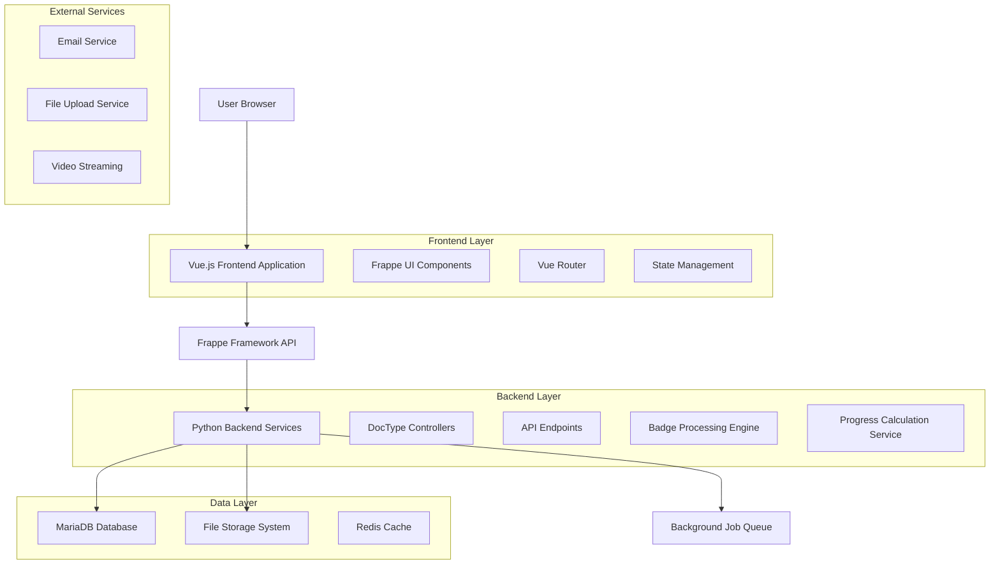
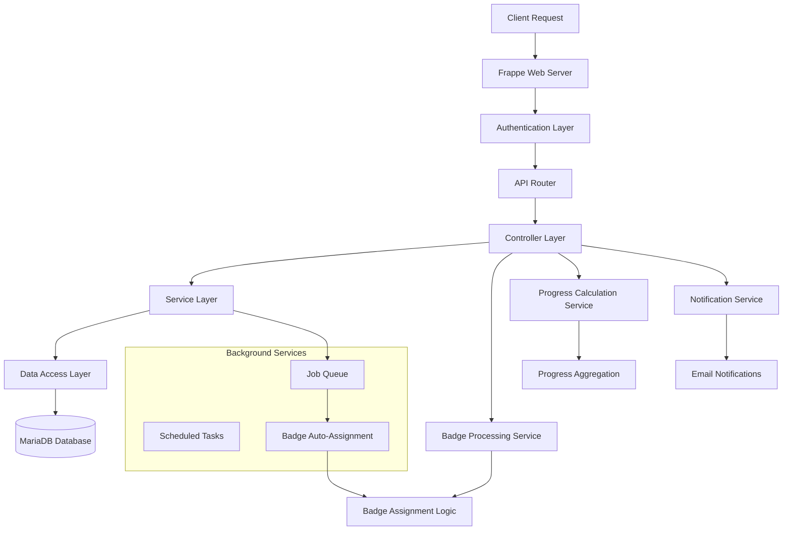
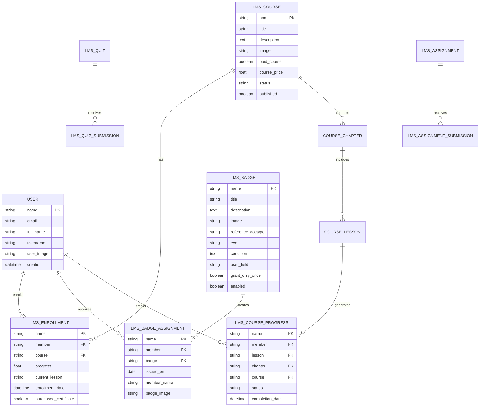

# Frappe LMS - Technical Architecture Document

## 1. Architecture Design



## 2. Technology Description

- **Frontend**: Vue.js@3 + Frappe UI + Vite + TailwindCSS
- **Backend**: Frappe Framework (Python) + MariaDB
- **Caching**: Redis
- **File Storage**: Local filesystem with web access
- **Background Jobs**: Frappe's built-in job queue system

## 3. Route Definitions

| Route | Purpose |
|-------|----------|
| `/lms` | Main LMS homepage with course discovery and featured content |
| `/courses/{course-slug}` | Individual course detail page with enrollment options |
| `/courses/{course-slug}/learn/{lesson-id}` | Interactive lesson learning interface |
| `/dashboard` | Student dashboard showing enrolled courses and progress |
| `/badges` | Personal badge gallery and achievement showcase |
| `/batches/{batch-id}` | Batch-specific learning environment and live classes |
| `/quiz/{quiz-id}` | Quiz taking interface with real-time feedback |
| `/assignment/{assignment-id}` | Assignment submission and review portal |
| `/certificate/{certificate-id}` | Certificate display and verification page |
| `/admin/settings` | Administrative interface for system configuration |
| `/statistics` | Analytics dashboard for instructors and administrators |

## 4. API Definitions

### 4.1 Core Gamification APIs

**Badge Management APIs**

```
POST /api/method/lms.lms.doctype.lms_badge.lms_badge.assign_badge
```

Request:
| Param Name | Param Type | isRequired | Description |
|------------|------------|------------|-------------|
| badge | string (JSON) | true | Badge configuration object with assignment criteria |

Response:
| Param Name | Param Type | Description |
|------------|------------|-------------|
| message | string | Success or error message |
| assigned_count | integer | Number of badges assigned |

Example:
```json
{
  "badge": {
    "name": "course-completion",
    "event": "Auto Assign",
    "reference_doctype": "LMS Enrollment",
    "condition": {"progress": 100},
    "user_field": "member"
  }
}
```

**Progress Tracking APIs**

```
POST /api/method/lms.lms.doctype.course_lesson.course_lesson.save_progress
```

Request:
| Param Name | Param Type | isRequired | Description |
|------------|------------|------------|-------------|
| lesson | string | true | Lesson identifier |
| course | string | true | Course identifier |

Response:
| Param Name | Param Type | Description |
|------------|------------|-------------|
| progress | float | Updated course progress percentage |
| status | string | Success status |

```
GET /api/method/lms.lms.utils.get_course_progress
```

Request:
| Param Name | Param Type | isRequired | Description |
|------------|------------|------------|-------------|
| course | string | true | Course identifier |
| member | string | false | User identifier (defaults to current user) |

Response:
| Param Name | Param Type | Description |
|------------|------------|-------------|
| progress | float | Course completion percentage (0-100) |

**Analytics APIs**

```
GET /api/method/lms.lms.api.get_course_progress_distribution
```

Request:
| Param Name | Param Type | isRequired | Description |
|------------|------------|------------|-------------|
| course | string | true | Course identifier for progress analysis |

Response:
| Param Name | Param Type | Description |
|------------|------------|-------------|
| distribution | array | Progress distribution data for charts |
| total_enrolled | integer | Total number of enrolled students |
| completion_rate | float | Overall course completion percentage |

### 4.2 Content Management APIs

**Course Management**

```
POST /api/resource/LMS Course
```

Request:
| Param Name | Param Type | isRequired | Description |
|------------|------------|------------|-------------|
| title | string | true | Course title |
| short_introduction | text | true | Brief course description |
| description | text | false | Detailed course description |
| image | string | false | Course thumbnail image URL |
| paid_course | boolean | false | Whether course requires payment |

**Enrollment Management**

```
POST /api/method/lms.lms.api.enroll_in_course
```

Request:
| Param Name | Param Type | isRequired | Description |
|------------|------------|------------|-------------|
| course | string | true | Course identifier |
| member | string | false | User to enroll (defaults to current user) |

## 5. Server Architecture Diagram



## 6. Data Model

### 6.1 Data Model Definition



### 6.2 Data Definition Language

**Core LMS Tables**

```sql
-- User Management
CREATE TABLE `tabUser` (
    `name` VARCHAR(140) PRIMARY KEY,
    `email` VARCHAR(140) UNIQUE NOT NULL,
    `full_name` VARCHAR(140),
    `username` VARCHAR(140) UNIQUE,
    `user_image` TEXT,
    `enabled` TINYINT(1) DEFAULT 1,
    `creation` DATETIME(6) DEFAULT CURRENT_TIMESTAMP(6),
    `modified` DATETIME(6) DEFAULT CURRENT_TIMESTAMP(6) ON UPDATE CURRENT_TIMESTAMP(6)
);

-- Course Structure
CREATE TABLE `tabLMS Course` (
    `name` VARCHAR(140) PRIMARY KEY,
    `title` VARCHAR(140) NOT NULL,
    `short_introduction` TEXT,
    `description` LONGTEXT,
    `image` TEXT,
    `paid_course` TINYINT(1) DEFAULT 0,
    `course_price` DECIMAL(18,2) DEFAULT 0,
    `currency` VARCHAR(3) DEFAULT 'USD',
    `status` VARCHAR(20) DEFAULT 'Draft',
    `published` TINYINT(1) DEFAULT 0,
    `creation` DATETIME(6) DEFAULT CURRENT_TIMESTAMP(6),
    `modified` DATETIME(6) DEFAULT CURRENT_TIMESTAMP(6) ON UPDATE CURRENT_TIMESTAMP(6),
    INDEX `idx_status_published` (`status`, `published`)
);

CREATE TABLE `tabCourse Chapter` (
    `name` VARCHAR(140) PRIMARY KEY,
    `title` VARCHAR(140) NOT NULL,
    `course` VARCHAR(140),
    `idx` INT DEFAULT 0,
    `creation` DATETIME(6) DEFAULT CURRENT_TIMESTAMP(6),
    `modified` DATETIME(6) DEFAULT CURRENT_TIMESTAMP(6) ON UPDATE CURRENT_TIMESTAMP(6),
    FOREIGN KEY (`course`) REFERENCES `tabLMS Course`(`name`) ON DELETE CASCADE,
    INDEX `idx_course_order` (`course`, `idx`)
);

CREATE TABLE `tabCourse Lesson` (
    `name` VARCHAR(140) PRIMARY KEY,
    `title` VARCHAR(140) NOT NULL,
    `chapter` VARCHAR(140),
    `course` VARCHAR(140),
    `body` LONGTEXT,
    `content` LONGTEXT,
    `youtube` VARCHAR(200),
    `quiz_id` VARCHAR(140),
    `include_in_preview` TINYINT(1) DEFAULT 0,
    `idx` INT DEFAULT 0,
    `creation` DATETIME(6) DEFAULT CURRENT_TIMESTAMP(6),
    `modified` DATETIME(6) DEFAULT CURRENT_TIMESTAMP(6) ON UPDATE CURRENT_TIMESTAMP(6),
    FOREIGN KEY (`chapter`) REFERENCES `tabCourse Chapter`(`name`) ON DELETE CASCADE,
    INDEX `idx_chapter_order` (`chapter`, `idx`)
);

-- Enrollment and Progress
CREATE TABLE `tabLMS Enrollment` (
    `name` VARCHAR(140) PRIMARY KEY,
    `member` VARCHAR(140) NOT NULL,
    `course` VARCHAR(140) NOT NULL,
    `progress` DECIMAL(5,2) DEFAULT 0,
    `current_lesson` VARCHAR(140),
    `enrollment_date` DATETIME(6) DEFAULT CURRENT_TIMESTAMP(6),
    `purchased_certificate` TINYINT(1) DEFAULT 0,
    `certificate` VARCHAR(140),
    `creation` DATETIME(6) DEFAULT CURRENT_TIMESTAMP(6),
    `modified` DATETIME(6) DEFAULT CURRENT_TIMESTAMP(6) ON UPDATE CURRENT_TIMESTAMP(6),
    FOREIGN KEY (`member`) REFERENCES `tabUser`(`name`),
    FOREIGN KEY (`course`) REFERENCES `tabLMS Course`(`name`),
    UNIQUE KEY `unique_enrollment` (`member`, `course`),
    INDEX `idx_member_progress` (`member`, `progress`)
);

CREATE TABLE `tabLMS Course Progress` (
    `name` VARCHAR(140) PRIMARY KEY,
    `member` VARCHAR(140) NOT NULL,
    `lesson` VARCHAR(140) NOT NULL,
    `chapter` VARCHAR(140),
    `course` VARCHAR(140),
    `status` ENUM('Complete', 'Partially Complete', 'Incomplete') DEFAULT 'Incomplete',
    `member_name` VARCHAR(140),
    `completion_date` DATETIME(6),
    `creation` DATETIME(6) DEFAULT CURRENT_TIMESTAMP(6),
    `modified` DATETIME(6) DEFAULT CURRENT_TIMESTAMP(6) ON UPDATE CURRENT_TIMESTAMP(6),
    FOREIGN KEY (`member`) REFERENCES `tabUser`(`name`),
    FOREIGN KEY (`lesson`) REFERENCES `tabCourse Lesson`(`name`),
    UNIQUE KEY `unique_progress` (`member`, `lesson`),
    INDEX `idx_course_member_status` (`course`, `member`, `status`)
);

-- Gamification System
CREATE TABLE `tabLMS Badge` (
    `name` VARCHAR(140) PRIMARY KEY,
    `title` VARCHAR(140) NOT NULL UNIQUE,
    `description` TEXT,
    `image` TEXT NOT NULL,
    `reference_doctype` VARCHAR(140) NOT NULL,
    `event` ENUM('New', 'Value Change', 'Auto Assign') DEFAULT 'New',
    `condition` TEXT,
    `user_field` VARCHAR(140) NOT NULL,
    `field_to_check` VARCHAR(140),
    `grant_only_once` TINYINT(1) DEFAULT 0,
    `enabled` TINYINT(1) DEFAULT 1,
    `creation` DATETIME(6) DEFAULT CURRENT_TIMESTAMP(6),
    `modified` DATETIME(6) DEFAULT CURRENT_TIMESTAMP(6) ON UPDATE CURRENT_TIMESTAMP(6),
    INDEX `idx_reference_enabled` (`reference_doctype`, `enabled`)
);

CREATE TABLE `tabLMS Badge Assignment` (
    `name` VARCHAR(140) PRIMARY KEY,
    `member` VARCHAR(140) NOT NULL,
    `badge` VARCHAR(140) NOT NULL,
    `issued_on` DATE NOT NULL,
    `member_name` VARCHAR(140),
    `member_username` VARCHAR(140),
    `member_image` TEXT,
    `badge_image` TEXT,
    `badge_description` TEXT,
    `creation` DATETIME(6) DEFAULT CURRENT_TIMESTAMP(6),
    `modified` DATETIME(6) DEFAULT CURRENT_TIMESTAMP(6) ON UPDATE CURRENT_TIMESTAMP(6),
    FOREIGN KEY (`member`) REFERENCES `tabUser`(`name`),
    FOREIGN KEY (`badge`) REFERENCES `tabLMS Badge`(`name`),
    INDEX `idx_member_issued` (`member`, `issued_on` DESC),
    INDEX `idx_badge_issued` (`badge`, `issued_on` DESC)
);

-- Assessment System
CREATE TABLE `tabLMS Quiz` (
    `name` VARCHAR(140) PRIMARY KEY,
    `title` VARCHAR(140) NOT NULL,
    `course` VARCHAR(140),
    `max_attempts` INT DEFAULT 1,
    `passing_score` DECIMAL(5,2) DEFAULT 70,
    `time_limit` INT DEFAULT 0,
    `creation` DATETIME(6) DEFAULT CURRENT_TIMESTAMP(6),
    `modified` DATETIME(6) DEFAULT CURRENT_TIMESTAMP(6) ON UPDATE CURRENT_TIMESTAMP(6)
);

CREATE TABLE `tabLMS Quiz Submission` (
    `name` VARCHAR(140) PRIMARY KEY,
    `quiz` VARCHAR(140) NOT NULL,
    `member` VARCHAR(140) NOT NULL,
    `score` DECIMAL(5,2) DEFAULT 0,
    `status` ENUM('Pass', 'Fail', 'In Progress') DEFAULT 'In Progress',
    `submission_date` DATETIME(6) DEFAULT CURRENT_TIMESTAMP(6),
    `creation` DATETIME(6) DEFAULT CURRENT_TIMESTAMP(6),
    `modified` DATETIME(6) DEFAULT CURRENT_TIMESTAMP(6) ON UPDATE CURRENT_TIMESTAMP(6),
    FOREIGN KEY (`quiz`) REFERENCES `tabLMS Quiz`(`name`),
    FOREIGN KEY (`member`) REFERENCES `tabUser`(`name`),
    INDEX `idx_quiz_member_score` (`quiz`, `member`, `score` DESC)
);

-- Initial Badge Configuration
INSERT INTO `tabLMS Badge` VALUES
('welcome-badge', 'Welcome to Learning', 'Awarded upon first course enrollment', '/files/welcome-badge.png', 'LMS Enrollment', 'New', '', 'member', 1, 1, NOW(), NOW()),
('first-lesson-complete', 'First Steps', 'Completed your first lesson', '/files/first-lesson-badge.png', 'LMS Course Progress', 'New', 'doc.status == "Complete"', 'member', 1, 1, NOW(), NOW()),
('course-completion', 'Course Graduate', 'Successfully completed a full course', '/files/completion-badge.png', 'LMS Enrollment', 'Value Change', 'doc.progress == 100', 'member', 0, 1, NOW(), NOW()),
('quiz-ace', 'Quiz Master', 'Scored 100% on a quiz', '/files/quiz-master-badge.png', 'LMS Quiz Submission', 'New', 'doc.score == 100', 'member', 0, 1, NOW(), NOW()),
('dedicated-learner', 'Dedicated Learner', 'Enrolled in 5 or more courses', '/files/dedicated-learner-badge.png', 'User', 'Auto Assign', '{"name": ["in", ["select member from `tabLMS Enrollment` group by member having count(*) >= 5"]]}', 'name', 1, 1, NOW(), NOW());

-- Create indexes for performance
CREATE INDEX idx_lms_enrollment_member_course ON `tabLMS Enrollment` (member, course);
CREATE INDEX idx_lms_course_progress_course_status ON `tabLMS Course Progress` (course, status);
CREATE INDEX idx_lms_badge_assignment_member_badge ON `tabLMS Badge Assignment` (member, badge);
CREATE INDEX idx_user_enabled ON `tabUser` (enabled);
CREATE INDEX idx_lms_course_published_status ON `tabLMS Course` (published, status);
```

## 7. Key Implementation Details

### 7.1 Badge Processing Engine

The badge system uses Frappe's document event hooks to automatically process badge awards:

```python
# In lms/hooks.py
doc_events = {
    "*": {
        "after_insert": "lms.lms.doctype.lms_badge.lms_badge.process_badges",
        "on_update": "lms.lms.doctype.lms_badge.lms_badge.process_badges"
    }
}
```

### 7.2 Progress Calculation Algorithm

```python
def get_course_progress(course, member=None):
    """Calculate course completion percentage"""
    lesson_count = get_lessons(course, get_details=False)
    if not lesson_count:
        return 0
    
    completed_lessons = frappe.db.count(
        "LMS Course Progress",
        {
            "course": course,
            "member": member or frappe.session.user,
            "status": "Complete"
        }
    )
    
    precision = cint(frappe.db.get_default("float_precision")) or 3
    return flt(((completed_lessons / lesson_count) * 100), precision)
```

### 7.3 Security Considerations

- **Authentication**: Frappe's built-in session management
- **Authorization**: Role-based permissions for different user types
- **Data Validation**: Server-side validation for all inputs
- **SQL Injection Prevention**: Parameterized queries through Frappe ORM
- **XSS Protection**: Automatic HTML sanitization in templates

This technical architecture provides a comprehensive foundation for the Frappe LMS with robust gamification features and scalable design patterns.